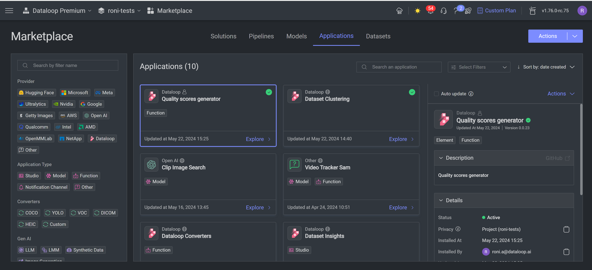

# Dataloop Image Quality Scoring App

This application processes images to compute two quality scores: blurriness and darkness. These scores help in
evaluating the visual quality of images uploaded to the Dataloop platform.

## Introduction

The Dataloop Image Quality Scoring App calculates blurriness and darkness scores for images in the Dataloop platform.
These scores are useful for assessing image quality in various applications such as automated inspections, dataset
curation, and machine learning preprocessing. This app is also integrated in Dataloop clean up tab.

## Features

-  ```Blurriness score```: The blurriness score is calculated using the Laplacian operator. The image is 
first converted to grayscale and then resized to save runtime if its dimensions exceed 1024x1024 pixels. The resizing 
is performed by finding the maximum dimension (width or height) and scaling it down to 1024 pixels while maintaining 
the aspect ratio by calculating an appropriate resize factor. After resizing, the variance of the Laplacian of the 
image is computed. This variance represents the blurriness of the image. To normalize this score, a sigmoid function is 
applied, mapping the score to a range between 0.5 and 1. To further spread this score across a range from 0 to 1, a slope 
and offset adjustment are applied.- Compute darkness score for each image.


- ```Darkness score``` - The darkness score is calculated by converting the image to grayscale and computing the mean 
pixel intensity. The score is then normalized by dividing by 255, with higher scores indicating brighter images and lower 
scores indicating darker images.


## Requirements

- Python 3.8 or higher
- Dataloop SDK
- OpenCV
- NumPy

## Installation - Dataloop's Marketplace

Go to Marketplace, application tab, and install the app: ```Quality scores calculator```



## Usage

Once the app is installed in your project, navigate to your dataset, click on ```Dataset Actions``` and then 
```Deployment slots```, and select the Quality 
Score Calculator.


*** The app includes a trigger that automatically calculates the scores for any new items uploaded to the dataset.